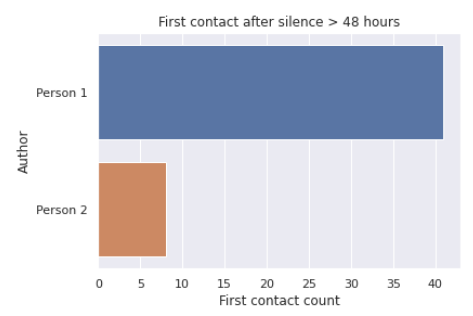

# WhatsApp chat analysis

A lot of insights can be gained from analysis of chat data between two or more people. This jupyter notebook helps answer questions like:
- How many messages have been written per author and how long are they?
- Which emojis are used how often per author and who uses emojis more frequently in general?
- Who tends to write back faster?
- Who tends to initiate contact more on a new day and after a period of silence? 
- What are the most frequently used words (word cloud)?

You can use this notebook to analyze your own WhatsApp chat data, which you can [export from WhatsApp](https://faq.whatsapp.com/android/chats/how-to-save-your-chat-history/?lang=en). You may need to change a few parameters at the beginning of the notebook, such as import file name and date format.

Here's an example (authors are anonymized):

## Message statistics

Person 2 has written about twice as many messages:

However, person 1 tends to write longer messages:

Some people break up their text into more messages than others. In order to determine who writes more it's better to look at total characters typed per author. Still, person 2 comes out on top:

## Activity

On average, messages were exchanged only on every 5th day, which is not that much:

There were time periods with a lot of contact, but also weeks or months without any messages:

## Emojis

Let's have a look at who uses more emojis. The metric "emojis per character typed" is obtained by dividing the number of emojis used by the total number of characters typed. Since some people repeat the same emoji for emphasis (😂😂😂😂😂), emoji frequency is calculated both for unique emojis (filtering out emoji repetitions) and for total emojis per message. Looks like person 1 is a more prolific emoji user:

These are the emojis used by the authors. Even though person 1 uses emojis more frequently, person 2 seems to have a broader emoji vocabulary:

## Reaction times

Now let's look at who tends to respond faster. This analysis only considers response times below 60 minutes. This could be an indicator of how much people are "glued" to their smartphones. In this example, reaction times are pretty equal. Both authors usually respond within 10 minutes:

## Contact initiation

Maybe the most interesting part is to look at who initiates contact more. This may be an indicator for how invested people are in their relationships or friendships. If it's always the same person initiating contact, there might an imbalance. Of course, there are other factors to consider, human relationships are very complex after all. 

It looks like person 1 tends to initiate contact first on a new day, although the difference is not that big:

However, when looking at first contact after a break of at least 48 hours, the difference is much more apparent. Person 1 clearly seems more interested in keeping in touch than person 2:

## Word cloud

Word clouds are a fun way to look at which words are used most frequently. They only provide limited insight though. After filtering out some very common words (stop words like "and", "so", etc), we get a word cloud like this:

